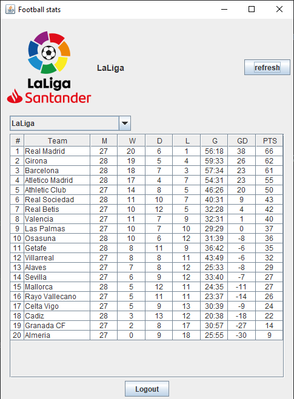
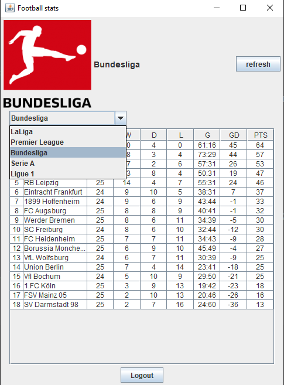
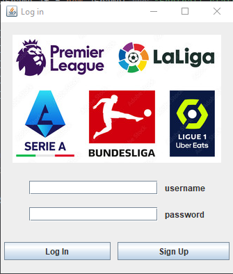
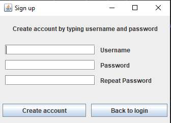
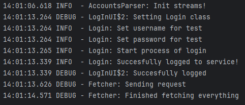

# Top 5 football leagues GUI App
> A GUI App buillt with Java 21 based on data collected from external [API-FOOTBALL](https://www.api-football.com). It allows you to track live standings from top 5 most popular football leagues in the world. 

## Table of Contents
* [General Info](#general-information)
* [Technologies Used](#technologies-used)
* [Features](#features)
* [Screenshots](#screenshots)
* [Project Status](#project-status)
* [Room for Improvement](#room-for-improvement)
* [Team](#team)

## General Information
- Application created as a final project for Obejct Oriented Programming subject at AGH University of Science and Technology.
- It simplifies following our all favourites leagues in one app.
- For academic purposes we added login and registration page to keep your league data safe 😉.
- While building this app we practiced a lot of crucial skills related to object-oriented programming in Java.
<!-- You don't have to answer all the questions - just the ones relevant to your project. -->

## Technologies Used
- Java - version 21.0
- Log4j - version 2.23.0
- Swing  - version 1.4

## Features
- The application features a built-in log mechanism that outputs logs to the console.
- For better security we implemented mechanism from external library [BCrypt](https://github.com/patrickfav/bcrypt), it decrypts all passwords provided during sign up process. 
- App uses basic multithreading while refreshing data and logging.

## Screenshots

 
 
 
 

## Project Status
Project is: _complete_ ✅  
Graded with a score of 5.0

## Room for Improvement

- It will be nice, to extend our project to all football leagues in Europe. 
- For better security, we can change the way of storing users sensitive data, by sending it to SQL database instead of simple .txt file.
- Instead of loading all images locally, we can get it from [API-FOOTBALL](https://www.api-football.com) by sending request while starting the app.

## Team
<table border="1">
  <tr>
    <td></td>
    <td></td>
  </tr>
  <tr>
    <td><a href="https://github.com/Wojtke7">Wojtke7</a></td>
    <td><a href="https://github.com/Patryk404">Patryk404</a></td>
  </tr>
</table>

<!-- Optional -->
<!-- ## License -->
<!-- This project is open source and available under the [... License](). -->

<!-- You don't have to include all sections - just the one's relevant to your project -->
